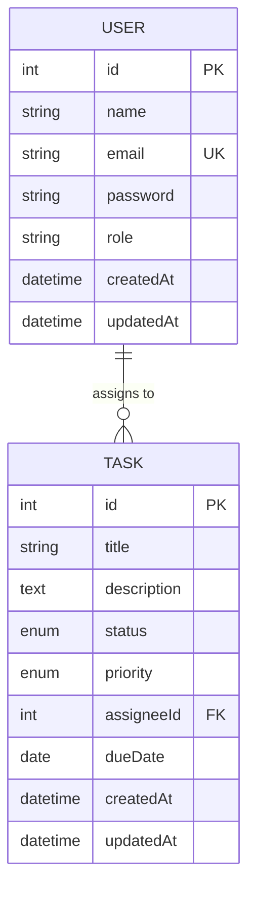
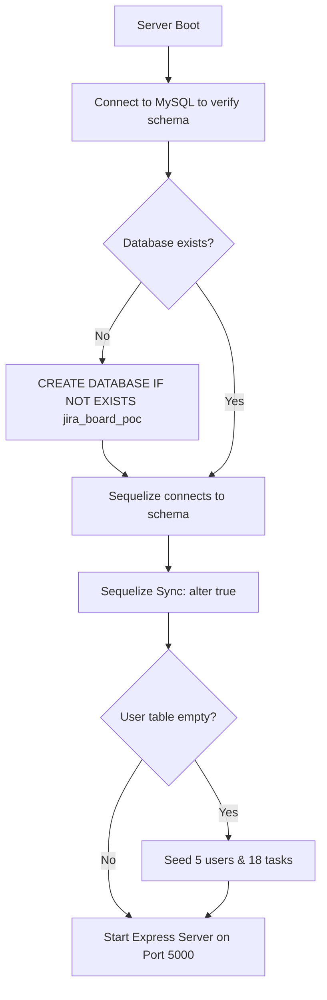

# Backend Architecture — Task & Team Workload Tracker

This document provides a detailed architectural overview of the Node.js + Express + Sequelize (MySQL) backend.

---

## 1. Architectural Overview & Design Pattern

The backend is built using a classic **MVC (Model-View-Controller) / Routing-Controller-Service** separation of concerns. This ensures that database interactions, routing mechanisms, and validation middlewares are cleanly isolated.

```
Request ──> Express Router ──> Validation / Auth Middleware ──> Controller ──> Sequelize ORM ──> MySQL
```

---

## 2. Directory Structure

The backend workspace is structured as follows:

* **`src/config/database.js`**: Controls the database connection. Establishes a raw MySQL connection first to auto-create the target schema if it does not exist, then initializes the Sequelize instance.
* **`src/models/`**: Defines the data models. Contains `user.js` and `task.js`, linked via `index.js` which configures model associations.
* **`src/middleware/`**: Implements global filters. Includes `auth.js` for verifying JSON Web Tokens (JWT) and `validation.js` for payload validations.
* **`src/controllers/`**: Houses the core business logic (user registration, login, task CRUD operations, and workload report aggregates).
* **`src/routes/`**: Binds HTTP endpoints to controller functions.
* **`src/app.js`**: Entry middleware configuration (CORS, JSON parser, Morgan logger, base routers).
* **`src/server.js`**: App entry point. Integrates database checks, syncs schemas, seeds mock database values, and boots the port listener.

---

## 3. Data Model & Associations

The system manages two entities with a relational one-to-many relationship:



### User Model
* `id`: Auto-incrementing primary key.
* `name`: Display name.
* `email`: Unique string, validated on insertion.
* `password`: Securely hashed using Bcrypt.
* `role`: User role ('Admin' or 'Member').

### Task Model
* `id`: Auto-incrementing primary key.
* `title`: String, required.
* `description`: Text area, nullable.
* `status`: Enum restricted to `'Todo'`, `'In Progress'`, and `'Done'`.
* `priority`: Enum restricted to `'Low'`, `'Medium'`, and `'High'`.
* `assigneeId`: Foreign key pointing to `User.id` (configured with `SET NULL` on user deletion).
* `dueDate`: Date only (YYYY-MM-DD), nullable.

---

## 4. Self-Provisioning & Seeding Flow

To ensure the POC runs instantly for reviewers without requiring manual SQL setup, the server executes a self-provisioning pipeline on start:



---

## 5. Security & Authentication Model

1. **Password Hashing:** Passwords are never stored in plain text. During registration (`POST /users`), they are hashed using **Bcrypt** with 10 salt rounds.
2. **JWT Sessions:** Upon successful registration or login (`POST /users/login`), the server issues a JSON Web Token signed with a 24-hour expiration time. The payload contains:
   ```json
   {
     "id": 1,
     "email": "admin@company.com",
     "role": "Admin"
   }
   ```
3. **Route Security:** The auth middleware intercepts headers and extracts the bearer token:
   `Authorization: Bearer <token>`
   If valid, it appends the decoded payload to `req.user` and calls `next()`. If invalid or missing, it responds with `401 Unauthorized` or `403 Forbidden`.

---

## 6. Input Validation Architecture

Validations are handled by custom Express middlewares prior to controller execution, ensuring that bad payloads never reach Sequelize operations:

* **User Register/Login:** Ensures names are present, emails match regex filters, and passwords are at least 6 characters long.
* **Task Creation/Updates:**
  * Checks that enums for `status` and `priority` match database restrictions.
  * Validates that `dueDate` is not in the past compared to the server's local date.
  * **FK Verification:** Before saving a task, queries the User model to verify that `assigneeId` corresponds to an existing user. If not, rejects the query with a descriptive error details body.

---

## 7. Reports Aggregation Query

The workload tracker uses standard database aggregation rather than loading records into memory:

```sql
SELECT 
    assigneeId, 
    status, 
    COUNT(id) AS taskCount 
FROM 
    Tasks 
LEFT JOIN 
    Users AS assignee ON Tasks.assigneeId = assignee.id 
GROUP BY 
    Tasks.assigneeId, Tasks.status, assignee.id;
```

In Sequelize, this is executed dynamically:
```javascript
const report = await Task.findAll({
  attributes: [
    'assigneeId',
    'status',
    [sequelize.fn('COUNT', sequelize.col('Task.id')), 'taskCount'],
  ],
  include: [
    {
      model: User,
      as: 'assignee',
      attributes: ['id', 'name', 'email', 'role'],
    },
  ],
  group: [
    'Task.assigneeId',
    'Task.status',
    'assignee.id',
    'assignee.name',
    'assignee.email',
    'assignee.role',
  ],
});
```
This guarantees high-performance query execution and accurate statistics.
